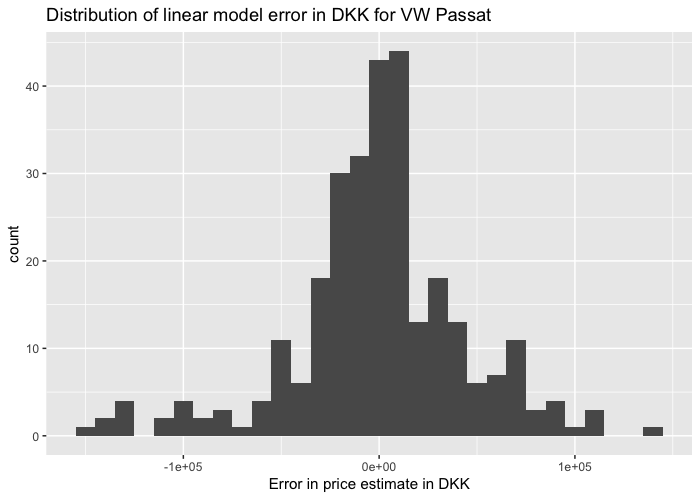
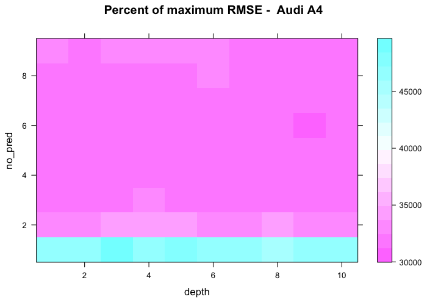

Testing Performance of Algorithms for Predicting Car Prices from Bilbasen
================

<!--- 
In order to execute this .Rmd file error-free run the following command in the console:
rmarkdown::render("Documents/DataScience/R/Bilbasen_analysis/Bilbasen_algorithm_test.Rmd")
-->
Content
-------

-   Introduction
-   Summary
-   Data Aquisition and Cleaning
-   Exploratory Data Analysis
-   Training and Test Data Sets
-   Tested Regression Methods
-   Conclusion

Summary
-------

The objective of the analysis is to select an algorithm for predicting the price of a used car, both currently and the next 10 years given expected milage. To achieve this a car has been selected and the available information from www.bilbasen.dk has been scraped and cleaned for the analysis. The app is able to analyse a narrow range of cars of the authors interest only because the cleaning steps have to be tailored to each manufacturer. Exploratory data analysis show that the problem is non-linear and further tests during linear regressions confirm this. All linear methods are inferior to any non-linear attempted. Of the non-linear methods the random forest and xgboost using a tree based method result in the lowest RMSE when applied to testing data. The random forest is selected as the method for predicting the price of the cars in the app.

Introduction
------------

This is a short documentation of the analysis performed in order to choose a good method for predicting car prices from www.bilbasen.dk. The main goal is to:

-   Determine the best method for predicting car prices based on a scrape from Bilbasen

This is to be used to estimate the devaluation of a car in time.

In order to determine the best model several methods are tested on one car brand and model and the main evaluation criteria is the RMSE. Additionally the MAE is calculated and reported as well for a slightly different view. It is not expected to yield a different conclusion, however if it does it is an interesting observation that would warrant a re-analysis of the problem.

The estimation of the devaluation of a car in time is based on the assumption that todays market is not changed due to external influences, e.g. a ban of diesel cars in major cities, and that the price of a specific car can be predicted in time given an expected distance driven per year.

The Shiny app is build in order to be able to make a more inform decision when buying used cars and has 3 main tabs for this purpose; Market Exploration, Cost and Info. In the market exploration tab the cars wanted for analysis can be selected. There is both the possibility of loading pre-scraped and cleaned data sets for a quick assesment or getting used to the tool or the possibility of scraping bilbasen.dk prior to load. Furthermore, one can input data on a given car which will be used in the market exploration and in the comparisons possible in the Cost tab. In the market exploration tab the estimated price of the single input car is shown together with a suite of graphs where that cars price (also an input parameter) is compared to that of all available cars on bilbasen. In the Cost tab the devaluation in time is shown. Furthermore, the total cost of owning and using that car in time is predicted. As an option up to 2 additional cars can be inputted using identical variables as the initial one. These are plotted as well and the cars can be compared. Finally, the info tab contains information on the number of cars available for analysis, the split between training and test data sets and information about the algorithm used to predict prices.

The analysis and subsequent prediction tool is designed for the authors personal car purchase and hence only a limited number of cars are presently available in the Shiny app (2019-01-26). The determination of the best suited algorithm is based on VW Passat. The selection of cars used is a very narrow segment of the market, and other cars would need to be imported and cleaned in order to expand the usability of the tool. As every car brand uses different names for different specifications, e.g. whether it is a station car or coupe or whether the transmission is automatic or manual, the cleaning process has to be specific to every brand. However, it is the belief of the author that the cleaning steps used in the scraping and cleaning code can fairly easily be adapted to most car brands. Note that the cleaning involves removing NA's hence the final dataframe does not contain such values. The datasets are of a decent size and the number of NA's removed is limited.

Data Aquisition and Cleaning
----------------------------

The data is scraped from www.bilbasen.dk using the R package `rvest` using a function `scrape_bilbasen(url, output_name)` which creates an `.tsv` file as output. The input to the functions are the mandatory variables:

-   `url`: The start page of the specific car brand and model. E.g. for a Volkswagen Passat it is <http://www.bilbasen.dk/brugt/vw/passat>. Some trial and error may be necessary to get the correct start page of any given car.

-   `output_name`: The final output get the output name with a date stamp. E.g. for a Volkswagen Passat this could be (using "vw\_passat" as output name) "vw\_passat\_2018-09-30.tsv".

The data set scraped from bilbasen.dk contains the variables `model`, `place`, `kml`, `km`, `year` and `price`. The header of the raw data set before cleaning looks like:

    ## # A tibble: 6 x 6
    ##   model                      place             kml        km  year price  
    ##   <chr>                      <chr>             <chr>   <dbl> <int> <chr>  
    ## 1 VW Passat 1,6 TDi 105 Com~ "Syd- og S\u00f8~ 22,7 k~   244  2011 104.50~
    ## 2 VW Passat 1,4 TSi 150 Com~ Vestjylland       19,6 k~    30  2017 329.90~
    ## 3 VW Passat 2,0 TDi 140 Com~ "Nordsj\u00e6lla~ 16,9 k~   236  2007 69.900~
    ## 4 VW Passat 2,0 TDi 140 Tre~ "Nordsj\u00e6lla~ 21,7 k~    72  2014 199.90~
    ## 5 VW Passat 2,0 TDi 190 Hig~ "Syd- og S\u00f8~ 21,7 k~   114  2016 343.88~
    ## 6 VW Passat 2,0 TDi 190 Hig~ "K\u00f8benhavn"  21,7 k~    47  2016 347.00~

The starting page of a Volkswagen Passat with available information in hmtl format is shown here:

The first variable, `model`, is a mixed text string containing a various information about the car. This variable is used to extract values to the variables in the cleaned up data set:

`brand`: Car manufacturer (character), `model`: Car model (character), `eng_size`: Engine size (numerical), `eng_type`: Engine type - gasoline, diesel, electrical etc (categorical), `HP`: Horse power (numerical), `transm`: Transmission type - manual or automatic (categorical), `type`: Car type - encoded to be either station car or coupe / not station car (categorical)

The remaining variables from the scraped html are cleaned up in various ways and results in the following final variables:

`place`: Place where the car is for sale (categorical), `kml`: Fuel efficiency \[km / L\] (numerical), `km`: Kilometers driven (numerical), `year`: Model year (integer), `price`: Sales price of the car (numerical)

`price` is the response variable and the rest will serve as predictors. The header of the cleaned data set looks like:

    ## # A tibble: 6 x 12
    ##   brand model eng_size eng_type    HP place   kml     km  year  price
    ##   <chr> <chr>    <dbl> <fct>    <dbl> <fct> <dbl>  <dbl> <int>  <dbl>
    ## 1 VW    Pass~      1.6 Diesel     105 "Syd~  22.7 244000  2011 104505
    ## 2 VW    Pass~      1.4 Gasoline   150 Vest~  19.6  30000  2017 329900
    ## 3 VW    Pass~      2   Diesel     140 "Nor~  16.9 236000  2007  69900
    ## 4 VW    Pass~      2   Diesel     140 "Nor~  21.7  72000  2014 199900
    ## 5 VW    Pass~      2   Diesel     190 "Syd~  21.7 114000  2016 343880
    ## 6 VW    Pass~      2   Diesel     190 "K\u~  21.7  47000  2016 347000
    ## # ... with 2 more variables: transm <fct>, type <fct>

The function `scrape_bilbasen(url, output_name)` is part of a larger function that imports and cleans the cars selected in the app called `scrape_and_clean_bilbasen_fun(car)`. `car` is a mandatory input given by the app. Both functions are available as scripts at: \*\*\*INSERT GITHUB LINK

As mentioned in the introduction the cleaning process depends on the brand of the car as e.g. automatic transmission has different names between the car manufactorers. The same is true for the engine type and station car variables. As an example a VW Passat station car with automatic gears and a gasoline engine will have a name like "VW Passat Variant 1,8 TSi DSG". Generally the cleaning process follow the same steps and several steps are invariant across different manufactorers, but certain steps have to be altered to fit the car under investigation. Unfortunately, this requires a decent amount of work to cover the entire market, hence only selected brands and models are investigated to create the intended dashboard and only a VW Passat station is used in the the analysis leading to the selection of the best model to predict the price of a car. However, it is possible to quite easily incorporate any car of interest. In the analysis no rows containing `NA` are kept. The number of missing data in the form of `NA`'s in the scraped raw data set is 1. In the cleaning process 175 rows containing `NA`'s or where the engine type is not either TSi, TDi, GTi or GTe are removed. There are various reasons for the creation of `NA`'s, the main reason being the generalised treatment of the information scraped. An example is the treatment of the `model` raw variable that contains more or less structured text that is separated into several temporary variables that are then used to create 7 of the final variables. Various more or less sophisticated methods for missing data imputation could of course be employed, but that has so far been outside the scope of the analysis. The data from bilbasen.dk is a mix of cars for sale (with and without VAT) and lease. In order to remove any leasing cars, as the listed price is per month, a filter removing all cars with a price less than 10,000 kr is applied. Any attempt at including information on whether a car is for sale without VAT has not been fruitful hence an unknown number of cars with a 20 percent lower price is present in the data set. Therefore, the analysis rests on the assumption that the impact of the VAT-less cars is negligable. These are far less common, but the exact number is unknown.

Exploratory Data Analysis
-------------------------

The cleaned up data set used to select the best method for estimating the price of a VW Passat from bilbasen.dk contains full information on 956 cars. The geographical distribution of these cars split by transmission type is shown here:

The distribution across the country is uneven favouring Jylland. Furthermore, there are more cars with automatic transmission than manual on the used car market. The sales price distribution in a histogram with a binsize of 25,000 kr is shown here:

The distribution is fairly even across the approximate price range 20,000 - 345,000 kr after which the number of cars for sale decreases rapidly. This is not surprising as the price get close to the new car price. A large number of cars are observed in the bin 345,000 - 370,000 kr. An explanation could be that a number of leasing cars are put on sale that fit into this price range, this is an untested hypothesis. The price plotted against place, model year and milage is shown here:

  

The price variation across the different regions in Denmark are not great, though Nordjylland and Lolland-Falster have the lowest medians and Koebenhavn (Copenhagen) the highest. Plotting the price against model year an expected trend is observed. The trend is obviously non-linear, it may be logarithmic or a power law. Two price jumps from 2010 to 2011 and 2014 to 2015 are observed as well. In both cases the exterior style of the VW passat was updated which does provide a likely explanation. Finally, the price against milage plot indicates a similar non-linear trend as model year. This also indicates that milage and model year are correlated - which seems very reasonable. The Pearson correlations between the continuous predictor variables are shown here:

    ##    price     year       HP      kml       km eng_size 
    ##     1.00     0.89     0.54     0.29    -0.83    -0.27

And the full correlation between all variables after dummy coding is shown here:

The price is highly correlated with model year and kilometers driven, correlated with transmission and horse power and somewhat correlated with engine type (positively with gasoline and negatively with diesel). Between the predictor variables it is observed that model year and kilometers are highly correlated as expected from the previous plots and model year is somewhat correlated with transmission, automatic transmission is getting more popular in recent years, and fuel efficiency. Engine size correlates positively with engine type diesel and negatively with gasoline. These correlations between predictors could indicate multicollinearity which is an issue when doing linear regressions. None of these correlation are unexpected. However, what is unexpected is the lack of correlation between price and place - it is common "knowledge" that cars are cheaper in Jylland. If this is true then the effect is marginal.

Training and Test Data Sets
---------------------------

The cleaned up data set is split pseudo-randomly into a training and test set. The split is 70/30 and the distribution of data points in the two sets in model year and milage are plotted here:

Model year and milage are used to QC the distribution of the pseudo-random split as they are the variables having the highest correlation with price. It is seen that the distribution of data points in the test set matches that of the training set, such that biases are not introduced by the split.

Tested Regression Methods
-------------------------

A series of regression methods are tested in order to select the best for the predictive tool.The methods tested are:

-   simple baseline model (mean price)
-   linear regression
-   linear regression with a log() transformed price
-   ridge / lasso / elastic net regressions
-   principal components regression
-   decision tree
-   random forest
-   k nearest neighbours
-   tree based XG boost
-   linear based XG boost

#### Baseline

As the very simplest model the mean price independent of any variable is calculated and used to calculate the RMSE. As is evident from the EDA this is a very poor model. The resulting RMSE and MAE are:

    ## [1] "RMSE using the baseline model: 122612.598859721"

    ## [1] "MAE using the baseline model: 106642.255036957"

#### Linear Regression

The linear regression is a backwards selection stepwise regression with 5 fold cross validation to use only those predictor variables that contribute to minimising the RMSE in the training data. When running the regression using the "leaps" package a warning is thrown stating that a linear dependency is found. That means one of the assumptions in linear regression is violated (that the predictors are (almost) independent). Furthermore, when performing a linear regression all the predictor variables should be linear with the dependent variable, which is not the case for the two variables that has the highest correlation with price. That is at least 2 violations of the basic assumptions. Another assumption is that the errors in the estimation are normally distributed. A histogram of the errors in the training model is plotted here:

The error distribution seems to be close to a normal distribution with a slight left skew. The error histogram in the test data:

In the test data case a more pronounced left skew of the distribution is observed. Using the Shapiro-Wilk test for normality the p-value is calculated: 2.852362910^{-9}. The null-hypothesis of normality can be rejected. The assumption of normally distributed errors is not fulfilled in this case. A linear regression is not an appropriate model to use to predict used car prices. The model has been build, so the result is presented here:

    ## [1] "RMSE using the linear model: 44536.5851260631"

    ## [1] "MAE using the linear model: 31616.9720499375"

#### Linear Regression with a log() Transformed Price

The same model described above is used, but with a logarithmic transformation of the target variable `price`. The warning stating 1 interdependancy is thrown in this case as well. The error distribution in the training set is shown here:

This distribution appears to be close to normal and the test error distribution is shown here:

In the test case the distribution does not look normal and the Shapiro-Wilk test yields a p-value of 2.003383510^{-7}. The error assumption in the log-linear space is rejected as well. The model has been build, so the result is presented here:

    ## [1] "RMSE using the log-linear model: 44742.1223899462"

    ## [1] "MAE using the log-linear model: 31552.633111582"

Note that the result, based on the RMSE, is equivalent to that using the standard linear regression even though the two highest correlating predictors are highly non-linear.

#### Ridge / Lasso / Elastic Net Regressions

Ridge, lasso and elastic net regressions are, a bit simplified, linear least squares regressions using a regularization term to avoid over-fitting the data. These three types of regressions are grouped in this analysis as they are just variations over the same basic formula for the loss function, *L*, that is minimised in the regression:

*L*(*α*, *λ*, *β*)=(**X***β* − **y**)2 + *λ*(((1 − *α*)/2)|*β*|2 + *α*|*β*|)

Where **y** is the actual values, **X** is the model matrix, *β* is the coefficients in the linear equation, *α* is a weight term between the *L*1 and the *L*2 norms and *λ* is the magnitude of the regularization. It is seen that in the special case where *α* = 0 the elastic net becomes a ridge regression (only the *L*2 norm is left in the regularization) and in the case where *α* = 1 it becomes a lasso regression (only the *L*1 norm is left in the regularization). The regressions are done using the `glmnet` package in `r` and all variables, predictors and response, are standardised.

##### Ridge

In ridge regression the *L*2 norm is used in regularsation (adding a bit of bias to the problem to limit the impact of large variances in case of multicollinearity - the so called variance-bias trade off). Effectively the ridge regression reduces the coefficients of all variables in order to avoid over-fitting. Therefore, no selection of collinear variables are made. The regression is performed on one hot coded variables of the data set and the reduction of coefficients as a function of log(lambda) is shown below. Note that the upper-y-axis shows the degrees of freedom (non-zero variables). After one hot coding the data set consists of 18 predictor variables, but no hybrid cars are present in the set, so only 17 are left. The lines in the plot are the coefficients, *β*, for all variables and it is seen that all converges to zero with large lambda, but none are excluded. The plot is shown here:

In order to determine the best lambda a sequence of lambda's is created and the MSE is calculated in the training data using 10 fold cross validation. The result is plotted here:

It is seen that for log(lambda) &lt; 10 a low MSE is achieved. The left dotted vertical line marks the lambda where the minimum MSE is achieved and the right marks the lambda where the model error is within 1 standard error of the minimum. In this analysis the lambda yielding the minimum MSE is used. The minimum MSE is found at:

    ## [1] "log(lambda) =  8.28930633477856"

    ## [1] "lambda =  3981.07170553497"

Using this value for lambda the RMSE and MAE of the ridge regression when predictions are made on the test set are:

    ## [1] "RMSE using the ridge regression model:"

    ## [1] 39428.34

    ## [1] "MAE using the ridge regression model:"

    ## [1] 29368.71

##### Lasso

Lasso (Least Absolute Shrinkage and Selection Operator) regression utilises the *L*1 norm in regularisation. On top of that the sum of the absolute value of the regression coefficents (the *L*1 norm) has to be below a fixed threshold, which forces some of the coefficients to zero. This creates a simpler model where only some variables are left. The analysis of the lasso regression follows that of the ridge conducted previously. The elimination of some variables with increasing lambda is shown here:

In the same manner as with the ridge regression the best lambda is determined using a sequence of lambda's and their corresponding MSE in the training data using 10 fold cross validation. The result is plotted here:

It is seen that for log(lambda) &lt; 10 a low MSE is achieved.

    ## [1] "log(lambda) =  6.68139048296889"

    ## [1] "lambda =  797.42715035466"

Using this value for lambda the RMSE and MAE of the lasso regression when predictions are made on the test set are:

    ## [1] "RMSE using the lasso regression model:"

    ## [1] 39491.75

    ## [1] "MAE using the lasso regression model:"

    ## [1] 29007.71

##### Elastic Net

As discussed previously in order to use the elastic net one more parameter needs to be considered - the mixing parameter of the ridge and lasso penalty terms, *α*. The cross validation method in `glmnet` is able to output the mean cross validation error `cvm` for a combination of alpha and lambda. This is used in a loop over many combinations of the two parameters while extracting the cvm in order to find the optimal combination of the alpha / lambda pair for the final elastic net regression. The result is plotted here:

It is seen that for the majority of the combinations the cvm does not vary much if at all. Why this is the case is not known. In general, the variation in the cvm is small. Knowing that the problem is non-linear it makes sense that this linear regression does an equally poor job no matter how the algorithm is tuned. However, an optimal parameter pair is found:

    ## [1] "Optimal alpha:  0.75"

    ## [1] "Optimal lambda:  969"

An alpha of 0.75 makes the elastic net regression closer to a lasso than a ridge. This is also seen in the coefficient plot when using the determined alpha:

This plot resembles the lasso plot from previous subsection. In the selected model the coeffients remaining after regulisation are:

    ## 19 x 1 sparse Matrix of class "dgCMatrix"
    ##                                              s0
    ## (Intercept)                       -1.866672e+07
    ## eng_size                          -7.468703e+03
    ## eng_typeDiesel                    -1.681026e+04
    ## eng_typeGasoline                   2.662134e+03
    ## eng_typeHybrid                     .           
    ## HP                                 1.025654e+03
    ## placeFyn                           .           
    ## placeK<U+00F8>benhavn              .           
    ## placeLolland-Falster               .           
    ## placeNordjylland                   .           
    ## placeNordsj<U+00E6>lland           .           
    ## placeSyd- og S<U+00F8>nderjylland  .           
    ## placeSyd- og Vestsj<U+00E6>lland   .           
    ## placeVestjylland                   .           
    ## kml                                5.763040e+03
    ## km                                -3.805797e-01
    ## year                               9.294790e+03
    ## transmmanual                      -4.478128e+04
    ## typestation                        5.065448e+03

It is seen that the place of the car for sale has been removed as the only variable (in the one-hot coded form). Using the optimal alpha / lambda pair the elastic net regression yields the following RMSE and MAE when used on the test set:

    ## [1] "RMSE using the elastic net regression model:"

    ## [1] 39442.58

    ## [1] "MAE using the elastic net regression model:"

    ## [1] 28996.9

#### Principal Components Regression

As was demonstrated in the EDA section, and in the above linear regressions, the core assumptions of linear regression are not fulfilled. A way to avoid some of these assumption is to linearise the problem and use only independent predictor variables. This can be achieved using principal components regression. Firstly, the problem is linearised and broken down to its eigen vectors, then a linear regression is attempted. The `pls` package provides a model that does this called `pcr()`. The options to scale and center the data are selected such that all variables are normalised to each other. The model uses 5 fold cross-validation too. Before using `pcr()` the categorical variables are dummy coded as the method cannot use factors and the surplus character and (original) categorical variables are removed. Based on the training data the RMSEP (default selection tool in the package) and number of components are plotted to determine the optimal `ncomp` tuning parameter:

Only looking at the plot gives a one-sided view on the ncomp selection. Another useful piece of information is the summary of the model:

    ## Data:    X dimension: 669 20 
    ##  Y dimension: 669 1
    ## Fit method: svdpc
    ## Number of components considered: 20
    ## 
    ## VALIDATION: RMSEP
    ## Cross-validated using 5 random segments.
    ##        (Intercept)  1 comps  2 comps  3 comps  4 comps  5 comps  6 comps
    ## CV          113646    66432    53063    49481    45614    45563    45369
    ## adjCV       113646    66349    52986    49212    45338    45294    45054
    ##        7 comps  8 comps  9 comps  10 comps  11 comps  12 comps  13 comps
    ## CV       45438    45520    45113     43169     43022     42674     36187
    ## adjCV    45159    45496    44177     42772     43003     42762     36063
    ##        14 comps  15 comps  16 comps  17 comps  18 comps  19 comps
    ## CV        36235     36233     36440     36446     36435     36585
    ## adjCV     36105     36098     36281     36155     36108     36180
    ##        20 comps
    ## CV        36750
    ## adjCV     36197
    ## 
    ## TRAINING: % variance explained
    ##        1 comps  2 comps  3 comps  4 comps  5 comps  6 comps  7 comps
    ## X        20.15    32.09    42.18    50.71    57.07    62.98    68.52
    ## price    66.00    78.40    81.56    84.64    84.68    85.07    85.07
    ##        8 comps  9 comps  10 comps  11 comps  12 comps  13 comps  14 comps
    ## X        73.94    79.25     84.49     89.42     94.32     97.94     99.15
    ## price    85.07    86.10     86.56     86.56     86.77     90.42     90.43
    ##        15 comps  16 comps  17 comps  18 comps  19 comps  20 comps
    ## X         99.71    100.00    100.00    100.00    100.00    100.00
    ## price     90.45     90.46     90.53     90.54     90.54     90.58

The `VALIDATION: RMSEP` part is the information for the plot. Furthermore, the `TRAINING: % variance explained` is provided. Looking only at where the curve flattens out it seems reasonable to select 4 principal components as the optimal `ncomp`. However, from the summary it is shown that this only explains 85% of the variance in the `price` variable. This means that too much information is discarded. A second kink the the curve is found at `ncomp` = 13 and using 13 principal components explains 90 % of the variance in `price`. Therefore, the number of principal components selected in this analysis is 13. Running the model on the test data yields the following RMSE and MAE:

    ## [1] "RMSE using a principal components regression model: 39382.4686818348"

    ## [1] "MAE using a principal components regression model: 29093.9711849543"

The RMSE using this method is lower than using the standard linear regressions. It is shown that in this case avoiding the violations of the regression assumptions using `pcr()` works better than ordinary regressions.

#### Decision Tree

A simple decision tree is also tested as the method is very interpretable. However, it is a simple model and the predicted price of any car has limited possible values in the leafs of the tree. An additional benefit of using the tree is that the model suggestion of the most important values are quite apparent and hence gives insight into the importance of the predictor variables. Both a pre- and post-pruned tree model is tested and the best is carried forward in the comparison between the different models. The packages used to create the decision trees is `rpart`.

##### Pre-pruned Tree

It is decided that a minimum of 30 cars in a leaf is required (`minbucket` parameter) such that the estimated price (average price of the cars falling into that terminal node) captures a general trend. This leaves the depth of the tree, `maxdepth`, as the only parameter under investigation. A tree model is build for every depth in the range 1 to 10 and both RMSE and MAE is calculated for each. The results are plotted here:

It is seen that a max depth of 5 is the optimal. The gradient of the curve becomes 0 after `maxdepth = 5` and this is because of the constraint on the `minbucket` parameter. If this had not been specified the plot would be:

It is seen that the maximum depth value is reasonable and the curve indeed evens out at approximate this depth. No additional complexity in terms of extra branches improves the fit. Hence the `minbucket = 30` is maintained. The RMSE and MAE using a pre-pruned tree model are:

    ## [1] "RMSE using a pre-pruned tree model: 32628.6495378495"

    ## [1] "MAE using a pre-pruned tree model: 24137.1834877619"

##### Post-pruned Tree

The post-pruned model does not have any control variables. This means that the algorithm runs on the training data until the most complicated tree is achieved. This model is then cut back to a reasonable level of complexity and then used to make a prediction on the test data. The RMSE and MAE are calculated based on the performance on the test data. The appropriate level of complexity can be estimated using the `rpart` function `plotcp()` that plots the cross validated relative error against complexity level, `cp`. The `cp` parameter is simply a measure of how much the R^2 is increased by using that split as well. The philosophy is the same as in previous examples that when the added complexity does not improve the relative error then the level of complexity used is reached. The plot is seen here:

The dashed horizontal line is the default suggestion of when the level of improvement is reached. Then the level of complexity (`cp` parameter) should be measured from the graph. It is decided that a level of `cp = 0.02` is an appropriate complexity level. A post-pruned model is created and applied to the test data. The RMSE and MAE using a post-pruned tree model are:

    ## [1] "RMSE using a post-pruned tree model: 42639.3824416969"

    ## [1] "MAE using a post-pruned tree model: 33518.4517696791"

It is seen that the pre-pruned tree model is has the lowest RMSE and MAE and hence this type of decision tree is used for comparison to the other methods.

##### Decision Tree Result

The pre-pruned tree is plotted here:

It is observed that the variables model year and milage are the most important variables for predicting the price. The `rpart` package includes a variable importance estimation while building a tree that is accessed here (percentage):

    ##     year       km       HP      kml   transm eng_type eng_size    place 
    ##    29.90    19.28    17.25    16.63    11.77     5.10     1.03     0.64 
    ##     type 
    ##     0.02

And as the tree suggests the most important variable is the model year followed by milages, horse power, fuel consumption and transmission type. What is not obvious from the tree is that milage, horse power and fuel consumption are of very similiar importance. Furthermore, the EDA showed that automatic transmission translate to a higher price than manual, but in the tree model this is of only low importance and is only used in a single split in the pre-pruned tree. The final RMSE and MAE used in the comparison with the other models are:

    ## [1] "RMSE using a decision tree model: 32628.6495378495"

    ## [1] "MAE using a decision tree model: 24137.1834877619"

#### Random Forest

The random forest method is an ensemble method utilising a multitude of decision trees for prediction. The decision tree is sensitive to noise as it models the data as is, including any random noise. The random forest uses bootstrapping and selects only a portion of the training data (with replacement) for each tree. This has the benefit of cancelling out parts of the random noise and hence reduces the variance in the model result. Additionally, a random subset of predictor variables are selected at each node of the individual tree. If some predictor variables are very strong predictors then these would be selected in many of the individual trees causing them to be correlated, this is avoided by bootstrapping. Generally, the random forest approach has an improved performance over the decision tree in terms of predictions, but with scores of trees the process effectively becomes a black-box (or close to) and the explainability is much lower. The random forest algorithm used in this analysis is from the package `randomForest`.

The algorithm has several parameters available. In this analysis `maxdepth`, `mtry` and `ntree` are used. `maxdepth` is the maximum depth of every tree in the ensemble, `mtry` is the number of predictor variables to chose from at each node and `ntree` is the number of trees in the ensemble. Performing several tests an `ntree` of 400 is chosen, as using more trees do not increase the accuracy sufficiently to warrant the increased computational resources. The RMSE of the randomForest is calculated for every combination of `maxdepth` (only depths of 1 to 10) and `mtry` (all available predictor variables) in order to chose the best combination for an RMSE for comparison with the other methods. While this analysis in general has only evaluated performance based on a VW Passat this evaluation looks at two additional cars because many combinations achieve similar performances. Also the methods should be applied to several cars and hence that extra information could be very valuable. The performances normalised to the poorest RMSE for every car are shown here:

  

The performance is dominated by the number of predictors for each node whereas the depth of the trees do not seem to exhibit any significant trend. The parameter values `mtry = 4` and `maxdepth = 6` are chosen as they seem to yield a good performance in all there cars. However, several other choices would be equally good as long as `mtry`is between 3 and 6. Information on the random forest model based solely on a VW Passat is shown here:

    ## 
    ## Call:
    ##  randomForest(formula = formula, data = car_train, maxdepth = 6,      mtry = 4, ntree = 400, importance = TRUE) 
    ##                Type of random forest: regression
    ##                      Number of trees: 400
    ## No. of variables tried at each split: 4
    ## 
    ##           Mean of squared residuals: 605245355
    ##                     % Var explained: 95.3

It is seen that 95% of the variance in the price is explained by the model. Futhermore, the importance of the predictor variables are shown here:

Both plots show a measure of importance, the left is the increment in MSE if the variable is not used and the right is the residual sum of squares. Both measures indicate that model year (`year`) and milage (`km`) are two variables of greatest importance. Transmission type (`transm`), horse power (`HP`) and fuel efficiency (`kml`) are the next three variables in terms of importance, however the two methods list their relative importance differently. Of the remaining 4 variables the type of the car (station car or coupe) is the variable of least importance. Finally, the RMSE and MAE of the random forest that is used in the comparison with the other methods are shown here:

    ## [1] "RMSE using a random forest model: 24989.3790135676"

    ## [1] "MAE using a random forest model: 17904.4598105863"

#### K Nearest Neighbours Regression

In k nearest neighbours (knn) all observations are grouped based on similarities with their (k) nearest neighbouring points in some space. The parameter k is the number of neighbours to use in the evaluation of similarity. It is tradionally a classification algorithm, however it can be used for regression. This is achieved by evaluating the average of the neighbourhoods and use this as the prediction. Just like in principal component regression the data needs to be normalised and the categorical variables need to be dummy coded. In this evaluation of performance the algoritm is tested using 1-100 neighbours to determine the best model - e.i. the one that yields the lowest RMSE. The knn method is the `knnreg` from the `caret` package. This plots shows the RMSE on the test set against k:

It is seen that evaluating 5 neighbours in the grouping yields the best model. The model's RMSE and MAE using 5 neighbours, which is used for comparison with the other methods are:

    ## [1] "RMSE using k nearest neighbours: 47890.6209515402"

    ## [1] "MAE using k nearest neighbours: 32704.9452463912"

#### Tree Based XG Boost

eXtreme Gradient Boosting (XG Boost) is an ensemble method for regression and classification. It utilises a number of weak learners to make a strong learner. The basic idea is to start with a single weak learner which should yield a prediction perhaps only slightly better than a random guess and then sequentially add new weak learners that improve the misfit of the previous sum. In order to optimise performance the next learner to add is the one that improves the misfit the most selected using the gradient of the loss function. For the tree based method every iteration adds a new tree that lowers the misfit and for the linear based method a linear function is added. The algorithm has a host of parameters to tune, making it more complicated to use than e.g. the simpler random forest. However, the method has proven to be rather precise in its predictions and has become quite popular. In this analysis only a few parameters has been used to tune the model and the remaining has been left at their default values. Tuning all the parameters was deemed rather time consuming, but the effort could probably yield better predictions than achieved here. The parameters tested for the tree based method are the maximum depth of the trees, `max_depth`, and the number of rounds, `nrounds`, which for the tree based method is the number of trees comprising the model. These two parameters are generally inversely related. The deeper the trees the more complex a system can be modelled using only a few trees, but this comes with a risk of overfitting the model. If shallower trees are used then more trees are needed to model the system, but in this case there is a risk of under-fitting if a sufficient number of trees are not used. In this analysis a balance between these are sought by calculating the error, the RMSE, on the test set for every combination of the two parameters. The RMSE against number of rounds and coloured by the maximum depth of the trees is plotted here:

The best combination of the parameters is `max_depth = 2` and `nrounds = 100` which is used to train the model. 100 rounds (trees) are chosen as the curve flattens out goint towards 100. There may be a few choises of `nrounds` that gives a slightly lower RMSE, but the interest is in the general trend. The model yields an importance output too in form of the gain by feature. The gain is the percentage contribution to the final result and can be seen as a measure of importance. The gain of course sums to 1. The feature importanceses are plotted here:

The predicted prices of the test data set is plotted against the (known) observed prices in this plot:

It is seen that all trends in the data has been accounted for and that in general the XG boost algorithm does a good job of predicting the price using the tree based method. Furthermore, the algorithm does the best job of predicting the price of less valuable cars. It was shown in the EDA section that e.g. the price of cars by model year has greater variability for newer cars than old and it is probably this fact that is reflected in the larger average misfit of the more expensive cars. The RMSE and MAE are:

    ## [1] "RMSE using an XG boost tree model: 23537.6675509015"

    ## [1] "MAE using an XG boost tree model: 17683.8663700117"

#### Linear Based XG Boost

The linear model used in the linear XG booster is an elastic net. That means that both alpha and lambda parameters need to be tuned on top of the number of weak learners (`nrounds`) that will comprise the total model. After some testing it was found that significantly more rounds were needed to achieve a good result compared to the tree boosting. After testing several combinations of alpha, lambda ranges and nrounds it is clear that that the lower the lambda (no or little regularisation) and the larger the number of rounds yields the best solution more or less independantly of alpha. See this plot of RMSE with alpha = 0.5:

The plot shows tha the smallest lambda possible and nrounds &gt; 2000 yields to best solution. Using nrounds = 2000 the two remaining elastic net parameters are tuned. Multiple combinations of alpha and lambda are used to derive the RMSE on the testing data in order to find the optimal solution. The results are plotted here:

 The plot shows that the result is fairly independent on alpha, where as lambda has an influence on RMSE. Low lambda yields low RMSE. It is possible to extract an optimal combination of alpha and lambda and using these and with nrounds = 2000 a model is build. The importance of the features in the model is plotted here:

The relative importance of the features correponds to the relative weights and they seem to be in more or less reverse order compared to the tree based approaches, which are performing better than the linear ones. It could indicate that something is not right in the model. This suspicion is further strengthened by the fact that the alpha parameter does not affect the result at all and that a lambda close to 0 is the best option. Ergo no regulization is the best approach even. These observations raises the suspicion that the modelling performed here is flawed. However, it could be that in this case the gradient descent method makes regulization unneccessary.

The predicted prices of the test data set is plotted against the (known) observed prices in this plot:

A residual non-linear trend in the data is observed in the plot. It shows that the linear approach is not working as well as the tree based, where no trend is left.

The RMSE and MAE from a xgboost model utilising a linear approach are:

    ## [1] "RMSE using an XG boost linear model: 40809.1721356404"

    ## [1] "MAE using an XG boost linear model: 30050.3647511977"

Conclusion
----------

The RMSE and MAE of the methods tested are compared here:

<table>
<thead>
<tr>
<th style="text-align:left;">
Method
</th>
<th style="text-align:left;">
RMSE
</th>
<th style="text-align:left;">
MAE
</th>
</tr>
</thead>
<tbody>
<tr>
<td style="text-align:left;">
Baseline
</td>
<td style="text-align:left;">
122613
</td>
<td style="text-align:left;">
106642
</td>
</tr>
<tr>
<td style="text-align:left;">
Linear regression
</td>
<td style="text-align:left;">
44537
</td>
<td style="text-align:left;">
31617
</td>
</tr>
<tr>
<td style="text-align:left;">
Linear regression - log transformed price
</td>
<td style="text-align:left;">
44742
</td>
<td style="text-align:left;">
31553
</td>
</tr>
<tr>
<td style="text-align:left;">
Ridge regression
</td>
<td style="text-align:left;">
39428
</td>
<td style="text-align:left;">
29369
</td>
</tr>
<tr>
<td style="text-align:left;">
Lasso regression
</td>
<td style="text-align:left;">
39492
</td>
<td style="text-align:left;">
29008
</td>
</tr>
<tr>
<td style="text-align:left;">
Elastic net regression
</td>
<td style="text-align:left;">
39443
</td>
<td style="text-align:left;">
28997
</td>
</tr>
<tr>
<td style="text-align:left;">
Principal components regression
</td>
<td style="text-align:left;">
39382
</td>
<td style="text-align:left;">
29094
</td>
</tr>
<tr>
<td style="text-align:left;">
Decision Tree
</td>
<td style="text-align:left;">
32629
</td>
<td style="text-align:left;">
24137
</td>
</tr>
<tr>
<td style="text-align:left;">
Random forest
</td>
<td style="text-align:left;">
24989
</td>
<td style="text-align:left;">
17665
</td>
</tr>
<tr>
<td style="text-align:left;">
kNN
</td>
<td style="text-align:left;">
47891
</td>
<td style="text-align:left;">
33675
</td>
</tr>
<tr>
<td style="text-align:left;">
XGboost Tree
</td>
<td style="text-align:left;">
23538
</td>
<td style="text-align:left;">
17684
</td>
</tr>
<tr>
<td style="text-align:left;">
XGboost Linear
</td>
<td style="text-align:left;">
40809
</td>
<td style="text-align:left;">
30050
</td>
</tr>
</tbody>
</table>
There is no ambiguity when comparing RMSE and MAE, hence the comparison between the different methods is exclusively based on the RMSE.

A variety of machine learning methods has been tested and they can be split into two groups; linear methods and non-linear methods. The linear methods have consistently been outperformed by the non-linear based on the RMSE from applying the methods to the test data set. Even the very simple and crude method of the decision tree with a limited discrete outcome of predicted prices performed better than any linear method. The reason for the poor performance is that the problem is non-linear. The two most important features (with the highest correlation with price) year and km (which are inter-correlated) exhibit non-linear behaviour. This conclusion is expected eventhough the methods should be tested.

Of the non-linear methods the two best performing algorithms are the random forest and the xgboost using the tree based method. The random forest algorithm was selected for the bilbasen analysis app.
